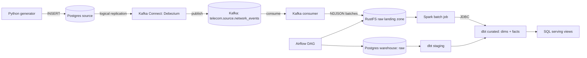

# Telecom Network Analytics

An end-to-end data platform for a mobile network operator. It answers two questions:

1. **Which cell sites and regions deliver a degraded quality of experience** — dropped or
   failed calls, low throughput, high latency, weak signal?
2. **Which subscribers show early churn signals** — falling usage after a poor network
   experience — so Retention can act before they leave?

Built incrementally, phase by phase. This delivery is **Phase 0: Infrastructure & Project
Skeleton**. The full problem statement, data model, pipeline design, data-quality plan and
phase roadmap are in [`docs/PROJECT_PLAN.md`](docs/PROJECT_PLAN.md).

## Architecture



Component-by-component walkthrough: [`docs/PROJECT_PLAN.md`](docs/PROJECT_PLAN.md), section 3.

## Tech Stack

| Layer | Technology |
|---|---|
| Source database | PostgreSQL 16.4 (`wal_level=logical`) |
| Change data capture | Kafka Connect + Debezium PostgreSQL connector 2.7.3 |
| Streaming backbone | Apache Kafka 3.8.0 (KRaft mode) |
| Kafka observability | Kafka UI (Provectus) 0.7.2 |
| Raw object storage | RustFS 1.0.0 (S3-compatible) |
| Warehouse | PostgreSQL 16.4 (separate instance) |
| Transformation (dims/facts) | dbt-core 1.8.7 / dbt-postgres 1.8.2 |
| Batch processing (aggregates) | Apache Spark 3.5.3 (standalone master + worker) |
| Orchestration | Apache Airflow 2.10.2 |
| Containerisation | Docker Compose |

Justification and rejected alternatives for every choice: `docs/PROJECT_PLAN.md`, section 4.

## Prerequisites

- Docker with Compose v2
- Python 3.10+ with the `venv` module (Debian/Ubuntu: `sudo apt install python3-venv`) and GNU Make
- About 6 GB of free RAM (the idle stack measures ≈ 3.3 GB) for the local stack (3× Postgres, Kafka, Kafka Connect,
  Kafka UI, RustFS, Spark master + worker, Airflow webserver + scheduler)
- Free host ports: 5432, 5433, 7077, 8080, 8081, 8083, 8085, 9000, 9001, 9092
  (all are bound to `127.0.0.1` only)

## Setup

```bash
git clone https://github.com/orhanahmadov/telecom-network-analytics.git
cd telecom-network-analytics

make init-env      # creates .env with freshly generated secrets (git-ignored)
make up            # builds the Airflow image and starts every service
make ps            # wait until all services are "healthy"
```

`make init-env` is `python3 scripts/init_env.py`: it copies `.env.example` to `.env` and
replaces every `CHANGE_ME` with a random value (including a valid Fernet key and Kafka
cluster id). `make up` runs it automatically if `.env` does not exist yet.

Service endpoints once the stack is up:

| Service | URL / address | Credentials |
|---|---|---|
| Airflow | http://localhost:8080 | `AIRFLOW_ADMIN_USER` / `AIRFLOW_ADMIN_PASSWORD` from `.env` |
| RustFS console | http://localhost:9001 | `RUSTFS_ACCESS_KEY` / `RUSTFS_SECRET_KEY` from `.env` |
| Spark master UI | http://localhost:8081 | — |
| Kafka UI | http://localhost:8085 | — |
| Kafka Connect REST | http://localhost:8083 | — |
| Postgres (source) | `localhost:5433`, database `SOURCE_POSTGRES_DB` | `SOURCE_POSTGRES_USER` / `SOURCE_POSTGRES_PASSWORD` |
| Postgres (warehouse) | `localhost:5432`, database `POSTGRES_DB` | `POSTGRES_USER` / `POSTGRES_PASSWORD` |
| Kafka broker | `localhost:9092` | — |

**Expected state:** every service shows `healthy`, except `airflow-init`, which is a
one-shot container and correctly shows `Exited (0)`.

### Python environment (generator, consumer, tests)

```bash
make venv          # creates .venv and installs pinned requirements-dev.txt
make test          # runs the test suite (no Docker needed)
```

### Try the ingestion skeleton

```bash
make register-connector          # register the Debezium connector (idempotent)
make generate COUNT=50           # write 50 synthetic events into the source Postgres
make consume BATCH_SIZE=50       # land them in RustFS; Ctrl+C after the first batch
make dbt-debug                   # dbt (inside Airflow) can connect to the warehouse
make smoke                       # connector RUNNING, both databases, RustFS and the Kafka topic are wired
```

## Stopping and Restarting

```bash
make down      # stop; state is kept in named Docker volumes
make up        # start again: Postgres data, Kafka log and RustFS objects survive
make clean     # full reset: stops everything and DELETES all volumes
```

Without Make, use `docker compose -f infra/docker-compose.yml --env-file .env <command>`.

## Project Structure

```
.
├── docs/
│   └── PROJECT_PLAN.md                 # problem, sources, architecture, model, DQ, roadmap, risks
├── infra/
│   ├── docker-compose.yml              # every service, pinned images, healthchecks, named volumes
│   ├── airflow/Dockerfile              # Airflow image + dbt in an isolated virtualenv
│   ├── postgres/init.sql               # warehouse: raw/staging/curated schemas + raw.network_events
│   ├── postgres-source/init.sql        # source: source.network_events table watched by Debezium
│   └── kafka-connect/
│       ├── postgres-source-connector.json   # Debezium connector configuration
│       └── register_connector.py            # registers/updates the connector via REST (idempotent)
├── ingestion/
│   ├── schemas.py                      # dataclasses: Subscriber, CellSite, NetworkEvent
│   ├── producer/
│   │   ├── generator.py                # synthetic events: stable population, degraded cells, dirty data, drift
│   │   └── db_writer.py                # CLI: writes generated events into source.network_events
│   └── consumer/
│       └── kafka_to_rustfs.py          # CLI: consumes the CDC topic, lands NDJSON batches in RustFS
├── orchestration/
│   └── dags/telecom_pipeline_dag.py    # Airflow DAG skeleton (load -> dbt staging/curated + Spark)
├── transformation/
│   ├── dbt_telecom/                    # dbt project: staging passthrough model; curated layer planned
│   └── spark_jobs/
│       └── cell_hourly_kpi_batch.py    # Spark job skeleton: RustFS -> agg_cell_hourly_kpi
├── config/
│   └── settings.py                     # single source of truth for all configuration
├── scripts/
│   ├── init_env.py                     # generates .env with random secrets from .env.example
│   └── smoke_check.py                  # checks the running stack is wired: connector, DBs, object store, topic
├── tests/                              # unit + contract tests (see below)
├── .env.example                        # every required variable, documented
├── requirements.txt                    # pinned runtime dependencies (host-side tools)
├── requirements-dev.txt                # + pytest, dbt (pinned)
└── Makefile                            # one-word entry points for everything above
```

Every top-level directory maps to a stage of the architecture diagram: `ingestion` =
source and ingestion, `infra` = storage/warehouse and supporting services,
`transformation` = dbt and Spark, `orchestration` = scheduling, `config` = central
configuration, `tests` = automated checks, `docs` = planning and design.

### Tests

`make test` runs 40+ tests without Docker. Besides unit tests they include **contract
tests** that keep the pieces consistent: every `${VAR}` in `docker-compose.yml` and every
variable read by `config/settings.py` must appear in `.env.example`; the columns the
writer inserts must match the source DDL; the raw table must mirror the source table;
all image tags must be pinned; every long-running service must have a healthcheck; host
ports must be loopback-only; the connector topic must match the configured topic.

## Current Status — Phase 0

**Delivered**

- Docker Compose brings up source Postgres (CDC-enabled), warehouse Postgres, Airflow's
  metadata Postgres, Kafka (KRaft), Kafka Connect (Debezium), Kafka UI, RustFS, Spark
  (master + worker) and Airflow (webserver + scheduler), with pinned image versions,
  healthchecks and persistent named volumes.
- `raw` / `staging` / `curated` schemas and the `raw.network_events` table are created in
  the warehouse, and `source.network_events` in the source database, on first boot.
- Ingestion skeleton: a synthetic generator (stable subscriber and cell population,
  hidden degraded cells, configurable dirty-record and schema-drift rates), a Postgres
  writer CLI, and a Kafka-to-RustFS consumer CLI — runnable and unit-tested. The Debezium
  connector is registered with one command (`make register-connector`).
- Orchestration skeleton: one Airflow DAG with the intended task graph, created paused.
- Transformation skeleton: a dbt project with a compilable staging passthrough model, and
  a Spark job skeleton with a working CLI.
- One-command secret generation (`make init-env`) and pinned dependencies.

**Not implemented yet (by design; scheduled in `docs/PROJECT_PLAN.md`, section 8)**

Real raw-to-Postgres loading (Phase 1), cleaned staging models and the curated
dimensional model (Phase 2), the Spark aggregation and the hourly schedule (Phase 3), data
quality checks wired into the DAG (Phase 4), serving views (Phase 5), and the
branching/CI workflow (Phase 6).

`dbt parse` prints one warning about the unused `curated` configuration path — expected
until Phase 2 adds models to that folder.

## Troubleshooting

- **A port is already in use** (commonly 5432 or 8080): stop the local service using it,
  or change the left-hand side of the port mapping in `infra/docker-compose.yml`.
- **A service is `unhealthy`:** `docker compose -f infra/docker-compose.yml --env-file .env logs <service>`.
- **RustFS reports permission denied on `/data`:** the volume was created with different
  ownership; run `make clean` and `make up` to recreate it.
- **`make up` after regenerating `.env` fails on Postgres login:** the existing volumes
  keep the *old* passwords. Run `make clean` first, then `make init-env` and `make up`.
- **Docker runs out of memory:** raise Docker's memory limit to at least 6 GB, or stop
  `kafka-ui` (it is not part of the data path).
