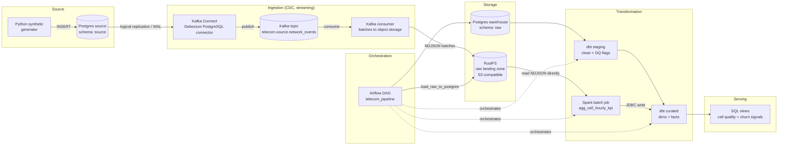

# PROJECT_PLAN — Telecom Network Quality & Churn-Signal Analytics Platform

## 1. Problem Statement

**Industry:** Telecommunications (mobile network operator).

**Business question:** Which cell sites and regions deliver a degraded quality of
experience (dropped/failed calls, low throughput, high latency, weak signal) — and do
the subscribers served by those cells show early churn signals (a sustained fall in
their own usage)?

**Consumers of the data**

| Consumer | What they need |
|---|---|
| Network Operations / Capacity Planning | A ranked list of the worst cell sites and regions per day/week, with the KPI that makes each one bad |
| Customer Retention / CRM | A weekly list of subscribers whose usage is falling *and* who recently had a poor network experience |

**Decisions the output supports**

1. Which cell sites get maintenance or capacity upgrades first (budget is limited, so ranking matters).
2. Which subscribers receive a proactive retention action (apology offer, data bonus, care call) — targeted at people who actually experienced a problem, not the whole base.

**Success criteria (checked in Phase 5):** each of the two questions above is answerable
with a *single* SQL query against the serving layer, and the answer refreshes on the
pipeline's schedule without manual work.

**Explicit non-goals:** no ML churn model, no real-time alerting, no real subscriber
data. "Churn signal" here is a documented heuristic (Section 5, `vw_subscriber_churn_signals`),
not a prediction.

**Domain model note.** The entity set (`subscriber`, `cell_site`, voice-call / data-session
/ SMS events) is a deliberately reduced slice of what an operator's probe / CDR
(call detail record) feeds contain. It is enough to compute network KPIs per cell and
usage per subscriber end-to-end without modelling the full operator estate.

## 2. Data Sources

| Attribute | Detail |
|---|---|
| Origin | A **self-written Python synthetic generator** (`ingestion/producer/generator.py`) that inserts rows into a source Postgres OLTP table (`ingestion/producer/db_writer.py`). Chosen over a public dataset because no open dataset exposes per-cell quality *and* per-subscriber usage together, and because volume, drift and dirtiness must be controllable and reproducible for grading. |
| Population | Fixed, seeded population: 2,000 subscribers (plans: ~60% prepaid, 30% postpaid, 10% corporate) across 60 cell sites in 8 regions (radio tech mix 3G 20% / 4G 60% / 5G 20%). About 10% of cells are secretly **degraded** (a hidden ground truth: higher drop rate, lower throughput, higher latency, weaker signal). The flag is never written into events — the analytics must rediscover it. |
| Format | Relational rows in `source.network_events` (Postgres). Debezium turns each insert into a JSON message on Kafka; the consumer lands those messages unchanged as NDJSON. |
| Volume estimate | `GENERATOR_EVENTS_PER_SECOND` (default 5) ≈ 432,000 events/day. A flat CDC record measures ≈ 0.57 KB as JSON (sampled from the generator), i.e. ≈ 0.25 GB/day of raw NDJSON. *(Estimate — measured for real in Phase 1.)* |
| Update frequency | Continuous at the source (CDC, streaming). Landed in RustFS in micro-batches (default: every 200 messages). Loaded to the warehouse and transformed in hourly batches (from Phase 3). |
| Event mix | ~50% data sessions, ~35% voice calls, ~15% SMS. |

**Source columns** (`infra/postgres-source/init.sql`): `event_id, event_type, event_time_raw,
subscriber_id, subscriber_msisdn_masked, subscriber_plan, subscriber_activation_date,
cell_id, cell_region, cell_radio_tech, signal_dbm, duration_sec, call_result,
data_volume_mb, avg_throughput_mbps, latency_ms, extra (jsonb), inserted_at`.
Phone numbers are masked (`+99450***1234`) — no real personal data exists anywhere.

**Sample records** (generator output, before flattening into columns):

```json
{
  "event_id": "b4d711bf-84a3-4fcd-b1f5-055c1d7fa098",
  "event_type": "data_session",
  "event_time": "2026-09-18T17:07:04.948473+00:00",
  "signal_dbm": -84.7,
  "duration_sec": 650,
  "call_result": null,
  "data_volume_mb": 23.4,
  "avg_throughput_mbps": 1.23,
  "latency_ms": 116.3,
  "subscriber": {"subscriber_id": "afb06406-...", "msisdn_masked": "+99499***1376", "plan": "corporate", "activation_date": "2022-01-21"},
  "cell": {"cell_id": "MIN-0029", "region": "Mingachevir", "radio_tech": "3G"}
}
```

A dropped voice call on a degraded cell looks like
`{"event_type": "voice_call", "call_result": "dropped", "duration_sec": 17, "signal_dbm": -118.3, ...}`.

**Known quality issues (injected on purpose)**

| Issue | Mechanism | Rate (configurable) |
|---|---|---|
| Missing subscriber | `subscriber_id` is NULL | share of `GENERATOR_DIRTY_RECORD_RATE` (default 5% of all events are dirty; one of five corruption types is chosen per dirty event) |
| Negative measurements | `duration_sec < 0` or `data_volume_mb < 0` | (same pool) |
| Unparseable timestamp | `event_time_raw = 'not-a-timestamp'` | (same pool) |
| Impossible signal | `signal_dbm > 0` (valid range is about −140…−44 dBm) | (same pool) |
| Schema drift | undocumented `volte_enabled` attribute appears inside `extra`, simulating a probe software upgrade | `GENERATOR_SCHEMA_DRIFT_RATE` (default 2%) |

**Known encoding effects of the CDC path** (not injected — properties of Debezium's default
JSON output that staging/loading must handle):

- `DATE` columns arrive as an integer = days since 1970-01-01.
- `JSONB` columns arrive as a JSON-*encoded string*, not a nested object.
- `TIMESTAMPTZ` arrives as an ISO-8601 string in UTC.
- `NUMERIC` would arrive as a base64-encoded structure by default; the connector sets
  `decimal.handling.mode=double` to avoid that.
- The connector applies Debezium's `ExtractNewRecordState` ("unwrap") transform, so Kafka carries
  the inserted row itself instead of a `before` / `after` / `source` envelope; the source change
  timestamp is added as `__source_ts_ms` and kept in `raw.network_events._cdc_source_ts_ms`.
- Delivery is at-least-once, so duplicates are possible after a restart.

## 3. Target Architecture



**Component walkthrough — what each part is and why it exists**

- **Generator** — the only component that *invents* data, so every downstream quality
  problem traces back to a documented cause. It writes into the source Postgres table and
  never talks to Kafka.
- **Postgres source (`source.network_events`)** — models where a real network-probe
  collector would persist events. Its purpose is to give the CDC connector a realistic
  system to watch.
- **Kafka Connect + Debezium** — reads the source database's write-ahead log through
  logical replication and publishes every insert to Kafka, with no application code involved.
  This is the ingestion step proper: it decouples the write path from everything downstream
  and gives ordered, replayable delivery.
- **Kafka (`telecom.source.network_events`)** — durable, replayable buffer between the CDC
  connector and the storage writer. If the writer is down, nothing is lost.
- **Kafka consumer → RustFS** — a thin writer that never transforms data: it batches
  messages into NDJSON objects whose key contains the offset range, making re-runs
  idempotent. Offsets are committed only after the object is stored.
- **RustFS** — S3-compatible object storage acting as the raw landing zone / data-lake
  layer: raw data is durable and readable by any S3-aware tool (including Spark) before it
  touches the warehouse.
- **Postgres warehouse — `raw`** — warehouse copy of the same raw data, loaded by an
  Airflow task so SQL-based transformation (dbt) can operate on it.
- **dbt staging** — 1:1 cleaned and typed *views* over `raw`: timestamp parsing, range
  checks, deduplication, drift extraction. Bad rows are **flagged, not dropped** (Section 7).
- **dbt curated** — dimension and fact *tables* that the business queries.
- **Spark batch job** — reads raw NDJSON from RustFS for one day (all its hour partitions) and computes
  `agg_cell_hourly_kpi` (cell × hour network KPIs), writing to `curated` over JDBC. It owns
  the one aggregate that scans *every* event and therefore outgrows row-by-row SQL first.
  Section 4 explains why this is Spark's job and not dbt's.
- **Airflow** — schedules and sequences `load_raw_to_postgres → dbt staging → dbt curated`
  and, in parallel, `load_raw_to_postgres → Spark`. It owns retries and failure handling.
  It does **not** orchestrate the generator, Debezium or the consumer — those are
  long-running services independent of the batch schedule.
- **Serving layer** — plain SQL views over `curated`. Any SQL client or BI tool can read
  them; no extra service is needed.

## 4. Tech Stack

| Component | Chosen technology | Reason | Rejected alternative |
|---|---|---|---|
| Source database | PostgreSQL 16.4 (`wal_level=logical`) | Realistic OLTP write path; exposes a logical replication slot for CDC | Generator publishing straight to Kafka — skips the "source system" stage entirely |
| Change data capture | Kafka Connect + Debezium PostgreSQL connector 2.7.3 | Standard "database is the source of truth, stream is the ingestion mechanism" pattern; reads the WAL without touching application code | Custom polling script — reinvents CDC, no offset management, easy to lose or duplicate events |
| Streaming backbone | Apache Kafka 3.8.0 (KRaft, single node) | Durable, replayable buffer between Debezium and the storage writer; no ZooKeeper to run | Direct file drop — no replay, no back-pressure |
| Kafka observability | Kafka UI 0.7.2 | Inspect topics, messages, consumer groups and connector status while developing | CLI only — works, but slower to iterate |
| Raw object storage | **RustFS 1.0.0** (S3-compatible) | Single lightweight binary, trivial in Compose, permissive Apache-2.0 licence, real data-lake landing zone | MinIO — functionally equivalent (its licence is AGPLv3); local filesystem — no S3 API, not realistic |
| Warehouse | PostgreSQL 16.4 (separate instance) | SQL target that dbt supports natively; easy to run and inspect locally | DuckDB — weaker story for concurrent access from Airflow and dbt together |
| Transformation (dims/facts) | dbt-core 1.8.7 + dbt-postgres 1.8.2 | Staging → curated layering with built-in tests, docs and lineage | Hand-written SQL run by Airflow — no tests/lineage, harder to maintain |
| Batch processing (aggregate) | Apache Spark 3.5.3 (standalone master + worker) | Reads raw NDJSON straight from RustFS (S3A) and computes the cell × hour aggregate; shows a genuine distributed batch engine on the one workload that scans all events | The same aggregate in dbt/SQL — fine at this volume, but does not exercise a batch-processing engine |
| Orchestration | Apache Airflow 2.10.2 (LocalExecutor) | DAG dependencies, task-level retries, UI | Cron + shell — no dependency graph, no retries, no UI |
| Data quality | dbt tests + staging DQ flags + one reconciliation check | Declared next to the models, run by `dbt test`, no extra service | Great Expectations — a second DQ framework not justified while dbt covers the required checks |
| Containerisation | Docker Compose | One-command reproducible infrastructure | Manual installs — not reproducible |
| Serving | Postgres SQL views on `curated` | No extra service; any SQL client or BI tool can consume them | Superset/Metabase as a *mandatory* component (kept optional) |

**One-new-tool declaration.** The rules allow at most one tool beyond the course stack.
This plan declares **RustFS** as that tool, justified above (a lightweight S3-compatible
landing zone with a permissive licence). PostgreSQL, Kafka, Airflow, dbt, Spark and Docker
Compose are treated as course technologies, and Kafka Connect / Debezium as part of the
Kafka ecosystem. *This classification is confirmed with the instructor before Phase 1
starts; the fallback if any of it is not accepted is listed in Section 9.*

## 5. Data Model

Flow: source → CDC stream → raw → staging → curated → serving.

| Layer | Storage | Contents | Grain | Key | Load / SCD strategy |
|---|---|---|---|---|---|
| Source | Postgres `source.network_events` | Rows inserted by the generator | 1 row = 1 event | `event_id` (PK) | Append-only; source of truth |
| CDC stream | Kafka `telecom.source.network_events` | One Debezium change event per insert | 1 message = 1 event | `event_id` | Append-only; replayable via consumer offsets |
| Raw (lake) | RustFS `raw/network_events/dt=YYYY-MM-DD/hr=HH/p<partition>_<first>-<last>.jsonl` | Unmodified flat CDC records (one row per event, plus `__source_ts_ms`), dirty rows included | 1 line = 1 event | `event_id` | Append-only; partitioned by UTC **ingestion hour** (a batch belongs to the hour its first message arrived, so event-time filtering happens in staging); the offset range in the object key makes re-runs overwrite, not duplicate |
| Raw (warehouse) | Postgres `raw.network_events` | Copy of the flat CDC record + `_source_object_key`, `_cdc_source_ts_ms`, `_loaded_at` | 1 row = 1 event | `event_id` (PK) | Idempotent load: `INSERT … ON CONFLICT (event_id) DO NOTHING`; already-loaded object keys are skipped |
| Staging | Postgres `staging` schema (views) | `stg_network_events` (typed, deduplicated, with a `dq_flags` array), `stg_network_events_valid`, `stg_network_events_rejected` | Same as raw | `event_id` | Views recomputed on every `dbt run`; bad rows are flagged and routed, never silently dropped |
| Curated | Postgres `curated` schema (tables) | Dimensional model + Spark aggregate (below) | See below | See below | Incremental where stated |
| Serving | Postgres views on `curated` | `vw_cell_quality_ranking`, `vw_subscriber_churn_signals` | Business-question shaped | — | Plain views, always current |

**Curated entities** (built in Phases 2–3):

| Entity | Built by | Grain | Key | Strategy |
|---|---|---|---|---|
| `dim_subscriber` | dbt | one row per subscriber **per validity period** | `subscriber_id` + `valid_from` | **SCD Type 2** on `plan` — churn analysis needs the plan *as of* the event (a prepaid→postpaid migration must not rewrite history) |
| `dim_cell_site` | dbt | one row per cell | `cell_id` | **SCD Type 1** (overwrite) — region/technology are stable enough that history is not analytically useful here |
| `fct_voice_call` | dbt | one row per voice call | `event_id` | Incremental, watermark on `event_time`, `unique_key = event_id` |
| `fct_data_session` | dbt | one row per data session | `event_id` | Incremental, watermark on `event_time`, `unique_key = event_id` |
| `agg_cell_hourly_kpi` | **Spark** | one row per `cell_id` × hour | `cell_id` + `kpi_hour` | Per-day partition rewrite: Spark writes a load table; Airflow then deletes and re-inserts that day in **one transaction** |

`agg_cell_hourly_kpi` columns: `call_attempts, dropped_calls, failed_setups, drop_rate,
data_sessions, total_volume_mb, avg_throughput_mbps, p95_latency_ms, avg_signal_dbm`.

**Serving views** (Phase 5):

- `vw_cell_quality_ranking` — cells ranked by a composite of drop rate, throughput and
  latency over a chosen window. Answers the Network Operations question.
- `vw_subscriber_churn_signals` — **heuristic**: a subscriber is flagged when
  (a) their last-7-day usage is at most 60% of their trailing 4-week weekly average **and**
  (b) they had at least 3 poor-experience events in the last 14 days (a dropped or failed
  call, or a data session with latency above 100 ms on 4G/5G). The thresholds are initial
  assumptions, tuned in Phase 5. Answers the Retention question.

## 6. Pipeline Design

- **Orchestration.** One Airflow DAG, `telecom_pipeline`, covering the batch portion only:
  `load_raw_to_postgres → dbt_run_staging → dbt_run_curated`, and in parallel
  `load_raw_to_postgres → spark_batch_cell_hourly_kpi`. The generator, Debezium connector
  and Kafka consumer are long-running services, not DAG tasks.
- **Scheduling.** The CDC path is continuous. The DAG is created **paused** and triggered
  manually until Phase 3, when it gets an hourly schedule — matching the "fresh within the
  hour, not sub-minute" latency the two consumers need (capacity planning and weekly
  retention lists do not need real-time data).
- **Batch vs. streaming.** Hybrid, three stages: (1) streaming CDC ingestion
  (Debezium/Kafka), (2) batch load + SQL transformation (Airflow + dbt), (3) batch
  distributed aggregation (Spark reading raw files directly from RustFS).
- **Idempotency and re-runs**
  - *Consumer:* object keys embed partition and offset range, and the date and hour come from the
    Kafka message timestamp — re-running the same offsets rewrites the same object.
  - *Raw load:* `ON CONFLICT (event_id) DO NOTHING`, plus skipping already-loaded object keys.
  - *dbt:* staging views are pure `SELECT`s; incremental facts use `unique_key = event_id`, so a re-run merges instead of duplicating.
  - *Spark:* processes one `--date` partition; the day is replaced atomically (delete + insert in one transaction), so re-running a date never appends twice.
- **Failure handling**
  - Airflow task retries (`retries: 2`, `retry_delay: 2 minutes`); the load task blocks both dbt and Spark, so bad raw data never silently reaches `curated`.
  - The DAG's `force_failure` param deliberately fails `load_raw_to_postgres` before it touches any data (trigger with `{"force_failure": "load_raw_to_postgres"}`), proving retries-with-delay and alerting work on a real run, and that a failed run leaves no partial state - re-triggering with the default `"none"` loads the same logical date normally.
  - Dirty records are carried through to staging and *flagged* so failures are visible in test results rather than hidden by pre-filtering.
  - Consumer offsets are committed only after the object is written (at-least-once, deduplicated downstream).
  - If Debezium's replication slot falls behind or the connector fails, that is visible through `GET /connectors/<name>/status` on the Connect REST API, independent of the DAG.
- **Expected runtime.** At 5 events/s, an hourly run handles ≈ 18,000 events; the whole DAG is expected to finish in about two minutes on a laptop. *(Estimate — validated when Phases 1–3 ship real task logic.)*

## 7. Data Quality Plan

Bad rows are **routed, not dropped**: `stg_network_events` computes a `dq_flags` array per
row; `stg_network_events_valid` (no flags) feeds `curated`, `stg_network_events_rejected`
keeps the rest with the reason, so nothing disappears without an audit trail.

| # | Check | Where enforced | Severity / on failure |
|---|---|---|---|
| 1 | `event_id` not null and unique | dbt `not_null` + `unique` on staging | **error** — `dbt test` fails and the DAG stops before `dbt_run_curated` |
| 2 | `event_time_raw` parses to a valid timestamp | staging cast → flag `bad_timestamp` | row moved to `rejected`; count reported in `dq_summary` |
| 3 | `subscriber_id` not null | staging flag `missing_subscriber` | row moved to `rejected` (cannot join to `dim_subscriber`) |
| 4 | `duration_sec >= 0` and `data_volume_mb >= 0` | staging flags `negative_duration` / `negative_volume` | row moved to `rejected` |
| 5 | `signal_dbm` within −140…−44 | staging flag `signal_out_of_range` | row kept, signal set to NULL, flag recorded (the rest of the event is still useful) |
| 6 | `call_result` ∈ {completed, dropped, failed_setup} for voice events | dbt `accepted_values` | **error** |
| 7 | Every `cell_id` exists in `dim_cell_site`; every `subscriber_id` in `dim_subscriber` | dbt `relationships` on the facts | **error** — no orphaned facts published |
| 8 | Schema drift: unknown keys in `extra` | staging extracts known drift fields (`volte_enabled`) into typed columns; everything else stays in `extra` | never dropped; a `dbt` singular test **warns** when an unrecognised key appears, prompting a model update |
| 9 | Freshness: newest `raw._loaded_at` is recent | `dbt source freshness` (`warn_after` 2 h) | **warn** |
| 10 | Completeness: row count in `source.network_events` vs `raw.network_events` for a closed time window | Airflow SQL check task | **warn** at >0.5% gap, **fail** at >2% (allowing for in-flight lag) |

Checks 1, 6, 7 block publication; the rest surface as counts in a `dq_summary` view.
Phase 4 wires all of it into the DAG and proves it with a deliberately corrupted batch.

## 8. Phase Roadmap

| Phase | Scope | Definition of Done |
|---|---|---|
| **0 — Infrastructure & skeleton** (this delivery) | Repo, structure, Docker Compose infra (source Postgres, warehouse Postgres, Airflow metadata Postgres, Kafka, Kafka Connect/Debezium, Kafka UI, RustFS, Spark master + worker, Airflow), central config, `.env.example`, pinned dependencies, placeholder modules with real imports, tests, docs | Every Phase 0 DoD item in the assignment: repo + instructor collaborator; everything pushed to `main`; plan complete; README followed from scratch works; fresh clone brings every service to healthy; down/up preserves state; no secrets in repo or history; pinned dependencies; meaningful commit history; every file explainable live |
| **1 — Ingestion & raw storage** | Connector registered automatically by Compose; generator and consumer run continuously; consumer flushes on time as well as size; implement `load_raw_to_postgres`; generator gains slow plan migrations (so SCD2 has something to track) and, optionally, usage decay for subscribers on degraded cells (so the churn heuristic can be validated) | A generated event travels source → Kafka → RustFS → `raw.network_events` with zero loss; killing and restarting the consumer or the load task creates no duplicates (proved by row counts); source/raw counts reconcile |
| **2 — Transformation** | Real staging models with DQ flags (Section 7) and the curated dimensional model (Section 5), including SCD2 `dim_subscriber` | `dbt run` + `dbt test` pass on a populated warehouse; every curated table matches its documented grain and key; a plan change in the source produces a second `dim_subscriber` row |
| **3 — Batch processing & orchestration** | Real Spark `agg_cell_hourly_kpi` (S3A read, JDBC write, atomic per-day replace); Airflow image gains a Spark client; hourly schedule; retries | A scheduled run completes unattended, including Spark; re-running a past date changes no row counts |
| **4 — Data quality & observability** | Wire checks 1–10 into the DAG; `dq_summary` view; freshness; reconciliation; failure alerting | A deliberately corrupted batch is caught, blocks `curated` refresh, and is reported; a healthy batch passes untouched |
| **5 — Serving & consumption** | `vw_cell_quality_ranking`, `vw_subscriber_churn_signals`, tuned thresholds; optional dashboard | Both business questions from Section 1 are answered by one query each; the hidden degraded cells rank near the top |
| **6 — Branching workflow & CI** | Pull-request workflow, CI running `pytest`, `dbt parse`, compose validation; documentation pass | PRs required for `main`; CI green on a sample PR |

## 9. Risks & Assumptions

| Risk / assumption | Mitigation |
|---|---|
| The stack may exceed the "one new tool" allowance (RustFS declared; Debezium/Kafka Connect and Spark assumed covered by the course) | Confirm with the instructor before Phase 1. Fallbacks: JDBC polling script instead of Debezium; the aggregate in dbt/SQL instead of Spark. Both keep the rest of the design intact |
| RustFS is a young project with a smaller community than MinIO; fewer references for troubleshooting | Image pinned to a tag; consumer and Spark depend only on the S3 API (`boto3` / S3A), so returning to MinIO is a configuration change |
| `bitnamilegacy/spark` is a frozen image: pinned and reproducible, but it receives no security updates | Acceptable for a local, loopback-only stack; migration path is the official `apache/spark` image (different start commands) |
| Debezium needs `wal_level=logical` and a replication slot; a misconfiguration silently stalls CDC | `wal_level=logical` is set explicitly in Compose and asserted by a test; Phase 1 adds a connector `/status` check, not just container health |
| An unconsumed replication slot makes Postgres retain WAL and can fill the disk | Local, small volume; Phase 4 alerts on slot lag; `make clean` resets everything |
| The full stack is heavy for a laptop (≈ 3.3 GB RAM measured at idle: 3× Postgres, Kafka, Connect, Kafka UI, RustFS, Spark ×2, Airflow ×2) | Spark worker capped at 1 core / 1 GB; documented in README prerequisites; Kafka UI can be stopped without affecting the pipeline |
| Synthetic data may not convincingly resemble real network telemetry | Tunable `GENERATOR_*` variables; a fixed seed for reproducibility; a documented hidden ground truth used to *validate* the analytics in Phase 5 |
| SCD2 and the churn heuristic are only meaningful if the synthetic data actually exercises them (plan changes, usage decay) | Scheduled explicitly in Phase 1 as generator work, not assumed |
| "Churn" has no label in synthetic data; the heuristic is a proxy | Stated as a non-goal in Section 1; thresholds documented and tunable; validated against the hidden degraded-cell ground truth |
| A fresh clone might fail on someone else's machine (ports 5432/5433/8080/9000 already used, low Docker RAM) | Reproducibility tested on a clean checkout before submission; README has a troubleshooting section; all secrets are generated by one command, so there is no manual editing to get wrong |
| Idempotency and failure-handling claims (Section 6) are only demonstrable once Phases 1–4 ship real logic | Each claim is a Definition-of-Done item of a specific phase, not claimed as done in Phase 0 |

## 10. How to Run

Prerequisites: Docker with Compose v2, Python 3.10+ (with the venv module), GNU Make, about 6 GB of free RAM (the idle stack uses ≈ 3.3 GB).

```bash
# 1. Clone
git clone https://github.com/orhanahmadov/telecom-network-analytics.git
cd telecom-network-analytics

# 2. Create .env with freshly generated secrets (git-ignored, mode 600)
make init-env

# 3. Start the whole infrastructure (builds the Airflow image on the first run)
make up

# 4. Wait until every service is "healthy" (airflow-init shows "Exited (0)" — expected)
make ps

# 5. Service UIs
#    Airflow      http://localhost:8080   (AIRFLOW_ADMIN_USER / AIRFLOW_ADMIN_PASSWORD from .env)
#    RustFS       http://localhost:9001   (RUSTFS_ACCESS_KEY / RUSTFS_SECRET_KEY from .env)
#    Spark master http://localhost:8081
#    Kafka UI     http://localhost:8085
#    Kafka Connect REST http://localhost:8083

# 6. Python environment for host-side tools and tests
make venv
make test

# 7. Register the Debezium connector, then try the ingestion skeleton
make register-connector
make generate COUNT=50
make consume BATCH_SIZE=50          # Ctrl+C after the first batch

# 8. Prove dbt can reach the warehouse from inside Airflow
make dbt-debug

# 9. Stop (data survives in named volumes) and start again
make down
make up

# 10. Full reset — deletes all volumes and state
make clean
```

Without Make, every target is a plain command listed in the `Makefile`.
